# Learnsphere - Intelligente Lernplattform mit KI-Unterstützung

Learnsphere ist eine moderne Learning Management System (LMS) Plattform, die Lehrpersonen und Studierende beim Erstellen, Verwalten und Absolvieren von Online-Kursen unterstützt. Durch die Integration von künstlicher Intelligenz werden Kursinhalte automatisch optimiert und personalisierte Lernempfehlungen generiert. Die Plattform kombiniert klassische LMS-Funktionen mit innovativen KI-Features, um ein effizienteres und individuelleres Lernerlebnis zu schaffen.

# Inhaltsverzeichnis
- [Learnsphere - Intelligente Lernplattform mit KI-Unterstützung](#learnsphere---intelligente-lernplattform-mit-ki-unterstützung)
- [Inhaltsverzeichnis](#inhaltsverzeichnis)
  - [Einleitung](#einleitung)
  - [Explore-Board](#explore-board)
    - [Trends \& Technologie](#trends--technologie)
    - [Potentielle Partner \& Wettbewerb](#potentielle-partner--wettbewerb)
    - [Fakten](#fakten)
    - [User](#user)
    - [Potenzialfelder](#potenzialfelder)
    - [Erkenntnisse](#erkenntnisse)
    - [Bedürfnisse](#bedürfnisse)
    - [Touchpoints](#touchpoints)
    - [How Might We?](#how-might-we)
  - [Create-Board](#create-board)
    - [Ideenbeschreibung](#ideenbeschreibung)
    - [Adressierte Nutzer](#adressierte-nutzer)
  - [Diskussion Feedback Pitch](#diskussion-feedback-pitch)
- [Anforderungen](#anforderungen)
  - [Funktionale Anforderungen](#funktionale-anforderungen)
    - [1. Benutzerverwaltung \& Authentifizierung](#1-benutzerverwaltung--authentifizierung)
    - [2. Kursverwaltung](#2-kursverwaltung)
    - [3. Lektionsverwaltung](#3-lektionsverwaltung)
    - [4. Fortschrittsverwaltung](#4-fortschrittsverwaltung)
    - [5. Quiz-System](#5-quiz-system)
    - [6. Dashboard \& Übersichten](#6-dashboard--übersichten)
  - [Nicht-funktionale Anforderungen](#nicht-funktionale-anforderungen)
    - [Performance](#performance)
    - [Sicherheit](#sicherheit)
    - [Usability](#usability)
    - [Wartbarkeit](#wartbarkeit)
    - [Verfügbarkeit](#verfügbarkeit)
    - [Technologie-Stack (Anforderungen)](#technologie-stack-anforderungen)
  - [Use-Case Diagramm](#use-case-diagramm)
  - [Use-Case Beschreibung](#use-case-beschreibung)
  - [Use-Case Diagramm](#use-case-diagramm-1)
    - [Beschreibung](#beschreibung)
    - [Akteure](#akteure)
    - [Use Cases - Schüler](#use-cases---schüler)
    - [Use Cases - Lehrer](#use-cases---lehrer)
    - [Systemgrenze](#systemgrenze)
    - [Beziehungen zwischen Use Cases](#beziehungen-zwischen-use-cases)
    - [Nicht im Diagramm enthaltene Use Cases](#nicht-im-diagramm-enthaltene-use-cases)
  - [Fachliches Datenmodell](#fachliches-datenmodell)
  - [UI-Mockup](#ui-mockup)
- [Implementation](#implementation)
  - [Frontend](#frontend)
  - [KI-Funktionen](#ki-funktionen)
  - [Optionale Anforderungen](#optionale-anforderungen)
- [Fazit](#fazit)
  - [Stand der Implementation](#stand-der-implementation)
    
## Einleitung

Die Digitalisierung der Bildung hat in den letzten Jahren stark an Bedeutung gewonnen. Während traditionelle Learning Management Systeme (LMS) wie Moodle oder Canvas sich auf die Verwaltung und Bereitstellung von Lerninhalten konzentrieren, bleibt die individuelle Anpassung und Optimierung dieser Inhalte oft eine manuelle und zeitaufwändige Aufgabe für Lehrpersonen.

Learnsphere adressiert diese Herausforderung durch den gezielten Einsatz von künstlicher Intelligenz. Die Plattform unterstützt Lehrpersonen beim Erstellen und Optimieren von Kursinhalten, während Studierende von personalisierten Lernpfaden und automatischen Fortschrittsanalysen profitieren. Durch die Kombination von Spring Boot im Backend, React im Frontend und OpenAI's GPT-Modellen entsteht eine moderne, skalierbare und benutzerfreundliche Lernumgebung.

Das Projekt wurde im Rahmen des Moduls "Software Engineering 2" entwickelt und demonstriert die praktische Anwendung von modernen Softwareentwicklungspraktiken, Clean Architecture Prinzipien und der Integration von KI-Services in eine produktionsreife Webanwendung.

## Explore-Board

Das Explore-Board analysiert den Markt, identifiziert Trends und definiert die Zielgruppe sowie deren Bedürfnisse im Kontext digitaler Lernplattformen.

### Trends & Technologie

Die E-Learning Landschaft entwickelt sich rasant und wird durch folgende technologische Trends geprägt:

- **KI-gestützte Lernsysteme:** Machine Learning Algorithmen ermöglichen personalisierte Lernpfade und automatisches Feedback
- **Gamification im Bildungsbereich:** Spielerische Elemente wie Badges, Punkte und Leaderboards erhöhen die Motivation
- **Microlearning:** Kurze, fokussierte Lerneinheiten (5-10 Minuten) statt lange Vorlesungen
- **Cloudbasierte Lernplattformen:** Skalierbare SaaS-Lösungen ersetzen lokale Installationen
- **Adaptive Lernpfade:** Systeme passen sich automatisch an den Wissensstand und Lernfortschritt an
- **Video-First Content:** Kurze Erklärvideos als primäres Lernmedium
- **Mobile Learning:** Zugriff auf Lerninhalte jederzeit und überall via Smartphone

### Potentielle Partner & Wettbewerb

**Etablierte Wettbewerber:**
- **Udemy / Coursera** – Marktführer mit Millionen von Nutzern und tausenden Kursen, jedoch wenig Personalisierung
- **LinkedIn Learning** – Business-fokussiert, starke Integration in LinkedIn
- **Moodle / Canvas** – Open-Source LMS, komplex und wenig intuitiv
- **edX** – Akademisch ausgerichtet, MOOC-Plattform

**Potentielle Partner:**
- **Kantonsschulen / Fachhochschulen** – Partner für Kursinhalte und Pilotprojekte
- **Auth0 / Azure** – Technische Partner für Authentifizierung, Hosting und Skalierung
- **OpenAI** – KI-Integration für intelligente Features
- **YouTube / Vimeo** – Video-Hosting für Lektionen

**Differenzierung:**
Learnsphere positioniert sich zwischen vollwertigen MOOC-Plattformen (zu komplex) und einfachen Kurs-Websites (zu limitiert). Der Fokus liegt auf **Einfachheit, KI-Integration und Personalisierung** für kleinere bis mittlere Bildungseinrichtungen.

### Fakten

Die Marktanalyse zeigt klare Trends und Potenziale:

- **Marktwachstum:** Der globale E-Learning Markt erreicht 2024 ein Volumen von über $400 Milliarden USD
- **Nachfrage:** 73% der Studierenden bevorzugen flexible Online-Lernlösungen gegenüber Präsenzunterricht
- **Personalisierung:** 67% der Lernenden wünschen sich individuell angepasste Lernpfade
- **KI-Potenzial:** Plattformen mit KI-Unterstützung zeigen 35% höhere Completion-Rates
- **Mobile-First:** 58% der Lernzeit findet auf mobilen Geräten statt
- **Video-Content:** 85% der Lernenden bevorzugen Video-Lektionen gegenüber Text
- **Retention:** Gamification erhöht die Retention-Rate um durchschnittlich 47%

### User

**Primäre Zielgruppe:**
- **Studierende** (18-30 Jahre), die selbstständig lernen wollen
  - Tech-affin, erwarten moderne UX
  - Suchen flexible Lernzeiten neben Studium/Arbeit
  - Wünschen sich klare Fortschrittsindikatoren

**Sekundäre Zielgruppe:**
- **Dozierende** (30-60 Jahre), die Kurse digital anbieten möchten
  - Wollen einfache Content-Erstellung
  - Benötigen Überblick über Lernfortschritt der Studierenden
  - Schätzen KI-Unterstützung bei Kurserstellung

**Tertiäre Zielgruppe:**
- **Berufstätige** (25-45 Jahre), die sich weiterbilden
  - Zeitlich stark eingeschränkt
  - Erwarten kompakte, praxisnahe Inhalte
  - Legen Wert auf anerkannte Zertifikate

### Potenzialfelder

Basierend auf der Nutzeranalyse wurden folgende Potenzialfelder identifiziert:

1. **Strukturierter Lernfortschritt**
   - Klare Visualisierung des Fortschritts (Kurs-, Lektions-, Quiz-Level)
   - Meilensteine und Checkpoints
   - Geschätzte Zeit bis zum Abschluss

2. **Motivation durch Feedback**
   - Unmittelbares Feedback nach Quiz-Absolvierung
   - Positive Verstärkung bei Fortschritten
   - Personalisierte Lernempfehlungen

3. **Interaktiver Austausch**
   - Kommentarfunktion bei Lektionen
   - Peer-Learning und Diskussionen
   - Teacher-Student Kommunikation

4. **Adaptive Lerninhalte**
   - KI passt Schwierigkeit an Wissensstand an
   - Wiederholung von schwachen Bereichen
   - Überspringen von bereits bekannten Inhalten

### Erkenntnisse

Aus User Research und Marktanalyse konnten folgende zentrale Erkenntnisse gewonnen werden:

**Motivation:**
- Nutzer verlieren Motivation ohne klare Lernziele und sichtbaren Fortschritt
- Lange Lektionen (>20 Min) führen zu Abbrüchen
- Fehlende Erfolgserlebnisse resultieren in niedriger Completion-Rate

**Feedback:**
- Individuelles, zeitnahes Feedback steigert Lernleistung um bis zu 30%
- Generisches Feedback wird als wenig hilfreich wahrgenommen
- Lernende wünschen sich konstruktive Verbesserungsvorschläge

**Lernformate:**
- Kürzere, interaktive Einheiten (Microlearning) wirken besser als lange Texte
- Video-Content wird bevorzugt, aber muss durch Quizzes ergänzt werden
- Mix aus verschiedenen Medien (Text, Video, Übungen) erhöht Retention

**Technologie:**
- Mobile-Nutzung nimmt zu, Desktop aber weiterhin wichtig für intensive Lernsessions
- Offline-Verfügbarkeit ist gewünscht, aber nicht zwingend erforderlich
- Schnelle Ladezeiten sind kritisch für User Experience

### Bedürfnisse

Die identifizierten Nutzerbedürfnisse bilden die Grundlage für die Plattform-Features:

**Transparenz & Orientierung:**
- Klarer Überblick über Lernfortschritt (prozentual, visuell)
- Strukturierte Kursübersicht mit Kapitel-Navigation
- Zeitschätzungen für Lektionen und Kurse
- Offene vs. abgeschlossene Inhalte klar erkennbar

**Zugänglichkeit:**
- Einfacher, schneller Zugang zu Lerninhalten ohne komplexe Navigation
- Responsive Design für Desktop, Tablet, Mobile
- Intuitive Benutzeroberfläche ohne Einarbeitung
- Single Sign-On via bekannte Plattformen (Google, GitHub)

**Personalisierung:**
- Individuelle Lernempfehlungen basierend auf Fortschritt
- Anpassbare Lerngeschwindigkeit
- Relevante Kursvorschläge
- Persönliches Dashboard mit Übersicht

**Motivation & Engagement:**
- Gamification-Elemente (Fortschrittsbalken, Badges)
- Positive Verstärkung bei Meilensteinen
- Soziale Features (Vergleich mit anderen, optional)
- Herausforderungen und Achievements

### Touchpoints

Die Interaktion mit der Plattform erfolgt über folgende zentrale Touchpoints:

**1. Landing Page / Marketing Website**
- Erste Anlaufstelle für neue Nutzer
- Klare Value Proposition
- Kursübersicht ohne Login

**2. Login / Registrierung (Auth0)**
- OAuth via Google, GitHub
- Einfacher Onboarding-Prozess
- Rollenauswahl (Student/Teacher)

**3. Dashboard**
- Personalisierte Startseite
- Übersicht eigener Kurse
- Fortschrittsstatistiken
- Empfehlungen

**4. Kursübersicht**
- Alle verfügbaren Kurse
- Filter- und Suchfunktion
- Kategorien und Tags
- Preview-Funktion

**5. Kursdetailseite**
- Kursbeschreibung
- Lektionsstruktur
- Einschreibungs-Button
- Bewertungen (optional)

**6. Video-Lektionen**
- Embedded YouTube Videos
- Fortschritts-Tracking
- Nächste/Vorherige Navigation
- Notizen-Funktion

**7. Quiz / Assessment**
- Multiple-Choice Fragen
- Sofortiges Feedback
- Punkteanzeige
- Wiederholungs-Möglichkeit

**8. Fortschrittsanzeige**
- Prozentuale Darstellung
- Grafische Visualisierung
- Historischer Verlauf
- Achievement-Übersicht

**9. Benachrichtigungen**
- E-Mail für neue Inhalte
- In-App Notifications
- Erinnerungen an unvollständige Kurse

### How Might We?

Die zentrale Design-Frage, die aus den Erkenntnissen abgeleitet wurde:

> **"Wie können wir Lernende motivieren und unterstützen, kontinuierlich Fortschritte zu machen, ohne überfordert zu werden?"**

Diese Frage führte zu folgenden Lösungsansätzen:

**Bite-Sized Learning:**
- Kurze Lektionen (5-15 Minuten)
- Klare Lernziele pro Lektion
- Schnelle Erfolgserlebnisse

**Intelligente Empfehlungen:**
- KI schlägt nächste Schritte vor
- Schwierigkeitsanpassung
- Personalisierte Lernpfade

**Gamification ohne Druck:**
- Optionale Achievements
- Positives Feedback
- Keine negativen Konsequenzen bei Fehlern

**Transparenter Fortschritt:**
- Jederzeit einsehbar
- Visuell ansprechend
- Motivierend gestaltet

---

## Create-Board

Das Create-Board konkretisiert die Lösungsidee und definiert Mehrwert, Zielgruppe und Alleinstellungsmerkmale von Learnsphere.

### Ideenbeschreibung

**Konzept:**
Learnsphere ist eine Lernplattform, die interaktive Kurse, personalisierte Lernpfade und KI-basiertes Feedback kombiniert, um Lernen effizienter und motivierender zu gestalten. Die Plattform vereint die Einfachheit moderner Web-Apps mit der Funktionalität klassischer LMS-Systeme.

**Kernfunktionalität:**
- **Kursverwaltung:** Teachers erstellen strukturierte Kurse mit Lektionen, Videos und Quizzes
- **Intelligente Empfehlungen:** KI analysiert Lernverhalten und schlägt passende Inhalte vor
- **Fortschritts-Tracking:** Automatische Erfassung und Visualisierung des Lernfortschritts
- **Interaktive Quizzes:** Sofortiges Feedback und detaillierte Erklärungen
- **Moderne Authentifizierung:** Sichere OAuth-Integration via Auth0

**Technologie-Stack:**
- Frontend: React 18 mit TypeScript und Tailwind CSS
- Backend: Spring Boot 3.4 mit Spring Security
- Datenbank: MongoDB Atlas (dokumentenbasiert)
- KI: OpenAI GPT-4 via Spring AI
- Cloud: Azure App Service

### Adressierte Nutzer

Die Plattform richtet sich an drei klar definierte Nutzergruppen:

**1. Studierende (Primär)**
- Alter: 18-30 Jahre
- Tech-affin, erwarten moderne Interfaces
- Suchen flexible Lernmöglichkeiten neben Studium/Job
- Wollen sichtbare Fortschritte und klare Ziele

**2. Berufstätige (Sekundär)**
- Alter: 25-45 Jahre
- Zeitlich stark eingeschränkt
- Fokus auf praxisnahe Weiterbildung
- Erwarten kompakte, effiziente Lerneinheiten

**3. Dozierende (Content Creators)**
- Alter: 30-60 Jahre
- Wollen digitale Kurse erstellen und verwalten
- Benötig

## Diskussion Feedback Pitch
Das Feedback zum Pitch von LearnSphere fällt insgesamt sehr positiv aus. Das Projekt ist klar strukturiert, logisch aufgebaut und adressiert die Bedürfnisse der Lernenden überzeugend. Besonders das Explore-Board zeigt eine fundierte Marktkenntnis mit schlüssig abgeleiteten Partnern und Wettbewerbern. Die How-Might-We-Frage ist präzise formuliert und gibt eine klare Richtung für die Ideation vor.

Im Create-Board wird das identifizierte Problem konsequent aufgegriffen und vollständig adressiert. Das Wow-Element wurde als technologisch stark bewertet, jedoch als noch etwas generisch wahrgenommen. Um sich deutlicher von Konkurrenzplattformen abzuheben, könnten zusätzliche, klar differenzierende Alleinstellungsmerkmale ergänzt werden.

Kritisch angemerkt wurde, dass die Bedürfnisse der Dozierenden nicht ausreichend berücksichtigt sind. Obwohl sie als Usergruppe definiert sind, fehlen ihre spezifischen Ziele sowohl in der Bedürfnisanalyse als auch in der How-Might-We-Frage, die sich aktuell ausschliesslich auf Lernende fokussiert.

Das Evaluate-Board rundet das Projekt überzeugend ab. Die gewählten KPIs, insbesondere Kursabschlussrate und Nutzerzufriedenheit, sind realistisch, sinnvoll und direkt auf Lernerfolg sowie Motivation ausgerichtet.

Insgesamt ist LearnSphere konzeptionell sehr stark. Verbesserungspotenzial besteht vor allem in der stärkeren Einbindung der Dozierenden und in einer präziseren Ausarbeitung des Wow-Elements.

# Anforderungen
## Funktionale Anforderungen

### 1. Benutzerverwaltung & Authentifizierung

**FR-001: Benutzerregistrierung und Login**
- Das System muss eine Registrierung und Anmeldung über OAuth 2.0 (Auth0) ermöglichen
- Unterstützte Provider: Google, GitHub
- Nach erfolgreicher Anmeldung erhält der Benutzer ein JWT-Token
- Das Token ist 24 Stunden gültig und muss danach erneuert werden

**FR-002: Rollenverwaltung**
- Das System unterscheidet zwischen zwei Rollen: `TEACHER` und `STUDENT`
- Die Rolle wird bei der Registrierung festgelegt
- Lehrer haben erweiterte Berechtigungen zur Kursverwaltung
- Studenten haben lesenden Zugriff und können Fortschritt tracken

**FR-003: Benutzerprofil**
- Jeder Benutzer hat ein Profil mit: Name, E-Mail, Profilbild (von OAuth-Provider)
- Das Profil ist einsehbar, aber nur vom Benutzer selbst editierbar
- Benutzer können ihr Konto löschen (inkl. aller zugehörigen Daten)

### 2. Kursverwaltung

**FR-004: Kurs erstellen (Teacher)**
- Lehrer können neue Kurse mit Titel und Beschreibung erstellen
- Optional: KI-gestützte Optimierung des Titels via OpenAI
- Beim Erstellen wird automatisch der `teacherSub` des Erstellers gespeichert
- Neue Kurse sind sofort für alle Benutzer sichtbar

**FR-005: Kurs bearbeiten (Teacher)**
- Lehrer können nur ihre eigenen Kurse bearbeiten
- Änderbar: Titel, Beschreibung
- Nicht änderbar: Ersteller (`teacherSub`), Erstellungsdatum
- Andere Lehrer haben keinen Zugriff auf fremde Kurse

**FR-006: Kurs löschen (Teacher)**
- Lehrer können nur ihre eigenen Kurse löschen
- Beim Löschen werden automatisch alle zugehörigen Lektionen und Quizzes gelöscht
- Fortschrittsdaten von Studenten werden ebenfalls entfernt
- Löschen ist irreversibel (keine Soft-Delete)

**FR-007: Kurs anzeigen (Alle)**
- Alle authentifizierten Benutzer können Kurse durchsuchen
- Kursdetails umfassen: Titel, Beschreibung, Ersteller, Anzahl Lektionen
- Liste aller Lektionen ist sichtbar (aber Inhalt nur für eingeschriebene Studenten)

**FR-008: Kursliste filtern und suchen**
- Benutzer können Kurse nach Titel durchsuchen
- Filterung nach Kategorien/Tags (falls vorhanden)
- Sortierung nach: Neueste, Beliebteste, Alphabetisch

### 3. Lektionsverwaltung

**FR-009: Lektion erstellen (Teacher)**
- Lehrer können Lektionen zu ihren Kursen hinzufügen
- Pflichtfelder: Titel, Reihenfolge (Order)
- Optionale Felder: Beschreibung, Video-URL (YouTube), Text-Content
- Lektionen werden automatisch nummeriert

**FR-010: Lektion bearbeiten (Teacher)**
- Lehrer können nur Lektionen ihrer eigenen Kurse bearbeiten
- Änderbar: Titel, Beschreibung, Content, Video-URL, Reihenfolge
- Änderung der Reihenfolge beeinflusst andere Lektionen automatisch

**FR-011: Lektion löschen (Teacher)**
- Lehrer können Lektionen aus ihren Kursen löschen
- Reihenfolge der verbleibenden Lektionen wird automatisch angepasst
- Fortschrittsdaten der Studenten für diese Lektion werden entfernt

**FR-012: Lektion anzeigen (Student)**
- Studenten können Lektionen eines Kurses durchgehen
- Inhalte werden in strukturierter Reihenfolge angezeigt
- Videos werden embedded (YouTube-Player)
- Text-Content wird formatiert dargestellt

**FR-013: Lektion als abgeschlossen markieren**
- Studenten können Lektionen als "abgeschlossen" markieren
- Status wird im Fortschrittssystem gespeichert
- Abgeschlossene Lektionen werden visuell hervorgehoben (grüner Haken)
- Markierung kann rückgängig gemacht werden

### 4. Fortschrittsverwaltung

**FR-014: Fortschritt automatisch tracken**
- Das System speichert automatisch den Fortschritt jedes Studenten
- Für jeden Kurs wird gespeichert: Anzahl abgeschlossener Lektionen, Gesamtanzahl Lektionen
- Fortschritt wird in Prozent berechnet: `(abgeschlossen / gesamt) * 100`
- Update erfolgt in Echtzeit nach Abschluss einer Lektion

**FR-015: Fortschritt anzeigen**
- Studenten sehen ihren Fortschritt auf dem Dashboard
- Darstellung: Fortschrittsbalken, Prozentangabe, "X von Y Lektionen"
- Fortschritt ist pro Kurs und kursübergreifend einsehbar
- Historischer Verlauf wird gespeichert (Datum der letzten Aktivität)

**FR-016: Kursempfehlungen basierend auf Fortschritt**
- Das System empfiehlt ähnliche Kurse basierend auf abgeschlossenen Kursen
- KI analysiert Tags und Kategorien für Empfehlungen (optional)
- "Nächste Schritte" werden auf dem Dashboard angezeigt

### 5. Quiz-System

**FR-017: Quiz erstellen (Teacher)**
- Lehrer können Quizzes zu Lektionen hinzufügen
- Quiz-Typ: Multiple-Choice (Single-Select oder Multi-Select)
- Jede Frage hat: Fragetext, 2-6 Antwortoptionen, Markierung der korrekten Antwort(en)
- Optional: Erklärung für jede Antwort (Feedback-Text)

**FR-018: Quiz bearbeiten und löschen (Teacher)**
- Lehrer können Quizzes ihrer Lektionen bearbeiten
- Änderbar: Fragen, Antworten, korrekte Markierung, Feedback
- Löschen entfernt Quiz und alle zugehörigen Student-Submissions

**FR-019: Quiz absolvieren (Student)**
- Studenten können Quizzes beliebig oft wiederholen
- System zeigt Fragen nacheinander oder alle auf einmal (konfigurierbar)
- Nach Absenden: Sofortige Auswertung und Anzeige der Punktzahl
- Falsche Antworten werden markiert, korrekte Lösungen angezeigt

**FR-020: Quiz-Ergebnisse speichern**
- Das System speichert alle Quiz-Versuche eines Studenten
- Gespeichert: Punktzahl, Datum, benötigte Zeit, Anzahl Versuche
- Bestes Ergebnis wird hervorgehoben
- Ergebnisse fließen in Fortschritts-Statistiken ein

### 6. Dashboard & Übersichten

**FR-021: Student Dashboard**
- Zeigt: Eingeschriebene Kurse, Fortschritt, letzte Aktivitäten
- Schnellzugriff auf: Nächste Lektion, offene Quizzes
- Kursempfehlungen basierend auf Interessen
- Statistiken: Gesamtfortschritt, abgeschlossene Kurse, Quiz-Performance

**FR-022: Teacher Dashboard**
- Zeigt: Eigene Kurse, Anzahl eingeschriebener Studenten pro Kurs
- Statistiken: Durchschnittlicher Fortschritt, häufigste Abbruchpunkte
- Schnellzugriff auf: Kurs erstellen, Kurs bearbeiten
- Übersicht über aktive Studenten

**FR-023: Kursübersicht (Explore Page)**
- Zeigt alle verfügbaren Kurse in Kachelansicht
- Informationen pro Kurs: Titel, Beschreibung, Ersteller, Anzahl Lektionen
- Filterung und Sortierung möglich
- "Einschreiben"-Button für Studenten (implizit beim ersten Lektion-Zugriff)

## Nicht-funktionale Anforderungen

### Performance

**NFR-001: Ladezeiten**
- Kursübersicht muss in < 2 Sekunden laden
- Einzelne Lektion in < 1 Sekunde
- API-Antwortzeiten < 500ms (95. Perzentil)

**NFR-002: Skalierbarkeit**
- System muss 1.000 gleichzeitige Benutzer unterstützen
- Datenbank-Abfragen müssen für 10.000+ Kurse optimiert sein
- Horizontale Skalierung über Load Balancer möglich

### Sicherheit

**NFR-003: Authentifizierung**
- Alle Endpoints (außer Login) erfordern gültiges JWT-Token
- Token-Validierung über Auth0 Public Key
- Refresh-Token-Mechanismus für nahtlose Session-Verlängerung

**NFR-004: Autorisierung**
- Rollbasierte Zugriffskontrolle (RBAC) auf Endpoint-Ebene
- Lehrer können nur eigene Ressourcen bearbeiten/löschen
- Studenten haben nur lesenden Zugriff auf Kurse

**NFR-005: Datensicherheit**
- Alle API-Kommunikation über HTTPS (TLS 1.3)
- Sensible Daten (z.B. E-Mail) werden gehashed in Logs
- Keine Plaintext-Speicherung von Passwörtern (OAuth, kein eigenes Password Management)

**NFR-006: DSGVO-Konformität**
- Alle Daten werden in EU-Region gespeichert (MongoDB Atlas Frankfurt)
- Benutzer können ihre Daten exportieren (JSON-Format)
- Benutzer können ihr Konto und alle Daten löschen
- Privacy Policy und Cookie-Banner sind implementiert

### Usability

**NFR-007: Benutzerfreundlichkeit**
- Intuitive Navigation mit maximal 3 Klicks zu jedem Feature
- Responsive Design für Desktop (1920px), Tablet (768px), Mobile (375px)
- Konsistente UI-Patterns und Komponenten (Design System)
- Barrierefreiheit: WCAG 2.1 Level AA

**NFR-008: Fehlerbehandlung**
- Aussagekräftige Fehlermeldungen für Benutzer (keine technischen Details)
- Validierung auf Frontend und Backend
- Graceful Degradation bei API-Ausfällen
- Offline-Modus mit Hinweis (für zukünftige Version)

### Wartbarkeit

**NFR-009: Code-Qualität**
- Mindestens 80% Test-Coverage im Backend
- Unit-Tests für kritische Business-Logik
- Integration-Tests für API-Endpoints
- Clean Architecture mit klarer Trennung von Layers

**NFR-010: Dokumentation**
- API-Dokumentation via Swagger/OpenAPI
- README mit Setup-Anleitung
- Inline-Code-Kommentare für komplexe Logik
- Architektur-Diagramme (C4-Model)

**NFR-011: CI/CD**
- Automatische Tests bei jedem Push (GitHub Actions)
- Automatisches Deployment nach Merge auf `main`
- Rollback-Mechanismus bei fehlgeschlagenen Deployments

### Verfügbarkeit

**NFR-012: Uptime**
- System-Verfügbarkeit von mindestens 99.5% (SLA)
- Monitoring mit Alerting bei Ausfällen
- Health-Check-Endpoint für Load Balancer

**NFR-013: Backup & Recovery**
- Tägliche Backups der MongoDB
- Point-in-Time Recovery möglich (bis zu 7 Tage zurück)
- Disaster Recovery Plan dokumentiert

### Technologie-Stack (Anforderungen)

**NFR-014: Backend-Technologien**
- Java 21 oder höher
- Spring Boot 3.4.x
- Spring Security mit OAuth 2.0 Resource Server
- Spring Data MongoDB
- Spring AI für OpenAI-Integration

**NFR-015: Frontend-Technologien**
- React 18.x mit TypeScript
- Tailwind CSS für Styling
- React Router für Navigation
- Axios für API-Kommunikation
- Zustand oder Context API für State Management

**NFR-016: Infrastruktur**
- MongoDB Atlas (M10 Cluster oder höher)
- Auth0 für Authentication
- OpenAI API (GPT-4 oder GPT-3.5-turbo)
- Azure App Service für Hosting (oder Vercel für Frontend)
- GitHub für Version Control und CI/CD
## Use-Case Diagramm

## Use-Case Beschreibung
## Use-Case Diagramm

### Beschreibung

Das Use-Case Diagramm zeigt die Hauptfunktionalitäten der Learnsphere-Plattform und die Interaktionen zwischen den beiden Hauptakteuren (Schüler und Lehrer) und dem System.

### Akteure

**1. Schüler (Student)**
- Primärer Nutzer der Lernplattform
- Konsumiert Lerninhalte und absolviert Kurse
- Trackt eigenen Lernfortschritt

**2. Lehrer (Teacher)**
- Content Creator und Kursverwalter
- Erstellt und pflegt Kurse und Lektionen
- Hat erweiterte Berechtigungen zur Verwaltung eigener Inhalte

### Use Cases - Schüler

**UC-001: Kurse ansehen**
- **Beschreibung:** Der Schüler durchsucht alle verfügbaren Kurse auf der Plattform
- **Vorbedingung:** Benutzer ist authentifiziert
- **Ablauf:**
  1. Schüler öffnet die Kursübersicht
  2. System zeigt alle verfügbaren Kurse mit Titel, Beschreibung und Metadaten
  3. Schüler kann Kurse filtern und durchsuchen
  4. Schüler wählt einen Kurs zur Detailansicht aus
- **Nachbedingung:** Schüler sieht Details zum ausgewählten Kurs
- **Alternative Abläufe:** 
  - Keine Kurse vorhanden → Hinweis "Noch keine Kurse verfügbar"
  - Suchfilter liefert keine Ergebnisse → "Keine passenden Kurse gefunden"

**UC-002: Lessons ansehen**
- **Beschreibung:** Der Schüler öffnet und konsumiert Lektionen innerhalb eines Kurses
- **Vorbedingung:** Schüler hat einen Kurs ausgewählt
- **Ablauf:**
  1. Schüler öffnet einen Kurs
  2. System zeigt Liste aller Lektionen in geordneter Reihenfolge
  3. Schüler wählt eine Lektion aus
  4. System zeigt Lektionsinhalt (Text, Video, etc.)
  5. Schüler kann zur nächsten/vorherigen Lektion navigieren
- **Nachbedingung:** Lektion wird angezeigt, Fortschritt wird getrackt
- **Alternative Abläufe:**
  - Lektion enthält Video → YouTube-Player wird embedded
  - Lektion nicht verfügbar → Fehlermeldung

**UC-003: Lessons abschliessen**
- **Beschreibung:** Der Schüler markiert eine Lektion als abgeschlossen
- **Vorbedingung:** Schüler befindet sich in einer Lektion
- **Ablauf:**
  1. Schüler konsumiert den Lektionsinhalt vollständig
  2. Schüler klickt auf "Lektion abschließen"
  3. System markiert Lektion als "completed"
  4. System aktualisiert Fortschrittsanzeige
  5. System schlägt nächste Lektion vor
- **Nachbedingung:** Lektion ist als abgeschlossen markiert, Fortschritt aktualisiert
- **Alternative Abläufe:**
  - Schüler möchte Markierung rückgängig machen → "Als unvollständig markieren"
  - Letzte Lektion abgeschlossen → Gratulation, Kurs-Zertifikat anbieten (optional)

**UC-004: Lessonsprogress tracken**
- **Beschreibung:** Das System erfasst und visualisiert automatisch den Lernfortschritt
- **Vorbedingung:** Schüler ist in einem Kurs eingeschrieben
- **Ablauf:**
  1. System überwacht Lektions-Abschlüsse
  2. System berechnet Fortschritt: `(abgeschlossene Lektionen / Gesamt) * 100%`
  3. System aktualisiert Fortschrittsbalken in Echtzeit
  4. System speichert Fortschritt in Datenbank (Progress-Entity)
  5. System zeigt Fortschritt auf Dashboard und in Kursansicht
- **Nachbedingung:** Aktueller Fortschritt ist persistent gespeichert und sichtbar
- **Alternative Abläufe:**
  - Kurs hat keine Lektionen → Fortschritt = 0%
  - Alle Lektionen abgeschlossen → Fortschritt = 100%, Kurs als "completed" markieren

### Use Cases - Lehrer

**UC-005: Kurse erstellen**
- **Beschreibung:** Der Lehrer erstellt einen neuen Kurs auf der Plattform
- **Vorbedingung:** Benutzer hat die Rolle "Teacher"
- **Ablauf:**
  1. Lehrer navigiert zu "Kurs erstellen"
  2. System zeigt Formular mit Feldern: Titel, Beschreibung
  3. Lehrer gibt Titel und Beschreibung ein
  4. Optional: Lehrer aktiviert KI-Optimierung des Titels
  5. System sendet Anfrage an OpenAI (falls aktiviert)
  6. System speichert Kurs mit `teacherSub` des Erstellers
  7. System bestätigt Erstellung und zeigt Kursdetails
- **Nachbedingung:** Neuer Kurs ist erstellt und für alle Nutzer sichtbar
- **Alternative Abläufe:**
  - Validierung schlägt fehl (z.B. Titel zu kurz) → Fehlermeldung
  - OpenAI-API nicht erreichbar → Warnung, Kurs wird ohne KI-Optimierung erstellt
  - Benutzer ist kein Teacher → 403 Forbidden

**UC-006: Kurse bearbeiten**
- **Beschreibung:** Der Lehrer bearbeitet einen bestehenden Kurs
- **Vorbedingung:** Lehrer ist Ersteller des Kurses
- **Ablauf:**
  1. Lehrer wählt einen eigenen Kurs aus
  2. Lehrer klickt auf "Bearbeiten"
  3. System zeigt Formular mit aktuellen Daten
  4. Lehrer ändert Titel und/oder Beschreibung
  5. Lehrer speichert Änderungen
  6. System validiert Eingaben
  7. System aktualisiert Kurs in Datenbank
  8. System bestätigt erfolgreiche Aktualisierung
- **Nachbedingung:** Kurs ist aktualisiert, Änderungen sind sofort sichtbar
- **Alternative Abläufe:**
  - Lehrer versucht fremden Kurs zu bearbeiten → 404 Not Found
  - Validierung schlägt fehl → Fehlermeldung mit Hinweis
  - Benutzer ist kein Teacher → 403 Forbidden

**UC-007: Kurse löschen**
- **Beschreibung:** Der Lehrer löscht einen eigenen Kurs permanent
- **Vorbedingung:** Lehrer ist Ersteller des Kurses
- **Ablauf:**
  1. Lehrer wählt einen eigenen Kurs aus
  2. Lehrer klickt auf "Löschen"
  3. System zeigt Sicherheitsabfrage: "Wirklich löschen? Alle Lektionen und Fortschritte werden ebenfalls gelöscht."
  4. Lehrer bestätigt Löschung
  5. System löscht Kurs, alle zugehörigen Lektionen und Progress-Einträge (Cascade Delete)
  6. System bestätigt erfolgreiche Löschung
  7. System leitet zurück zur Kursübersicht
- **Nachbedingung:** Kurs und alle abhängigen Daten sind unwiderruflich gelöscht
- **Alternative Abläufe:**
  - Lehrer bricht Löschung ab → Kurs bleibt bestehen
  - Lehrer versucht fremden Kurs zu löschen → 404 Not Found
  - Benutzer ist kein Teacher → 403 Forbidden

**UC-008: Lessons erstellen**
- **Beschreibung:** Der Lehrer fügt eine neue Lektion zu einem Kurs hinzu
- **Vorbedingung:** Lehrer ist Ersteller des Kurses
- **Ablauf:**
  1. Lehrer öffnet einen eigenen Kurs
  2. Lehrer klickt auf "Lektion hinzufügen"
  3. System zeigt Formular mit Feldern: Titel, Beschreibung, Content, Video-URL, Reihenfolge
  4. Lehrer gibt Daten ein
  5. System validiert Video-URL (falls angegeben, muss YouTube-URL sein)
  6. System speichert Lektion mit automatischer Nummerierung
  7. System fügt Lektion zur Kursliste hinzu
  8. System bestätigt Erstellung
- **Nachbedingung:** Neue Lektion ist erstellt und im Kurs sichtbar
- **Alternative Abläufe:**
  - Reihenfolge nicht angegeben → System wählt nächste verfügbare Nummer
  - Ungültige YouTube-URL → Fehlermeldung mit Hinweis
  - Validierung schlägt fehl → Fehlermeldung
  - Benutzer ist kein Teacher oder nicht Kursersteller → 403 Forbidden

**UC-009: Lessons bearbeiten** (implizit im Diagramm enthalten)
- **Beschreibung:** Der Lehrer bearbeitet eine bestehende Lektion
- **Vorbedingung:** Lehrer ist Ersteller des Kurses, dem die Lektion gehört
- **Ablauf:**
  1. Lehrer öffnet eine Lektion
  2. Lehrer klickt auf "Bearbeiten"
  3. System zeigt Formular mit aktuellen Daten
  4. Lehrer ändert Titel, Beschreibung, Content, Video-URL oder Reihenfolge
  5. System validiert Änderungen
  6. System speichert Aktualisierung
  7. System bestätigt erfolgreiche Änderung
- **Nachbedingung:** Lektion ist aktualisiert, Änderungen sofort sichtbar
- **Alternative Abläufe:**
  - Änderung der Reihenfolge → System passt andere Lektionen automatisch an
  - Validierung schlägt fehl → Fehlermeldung
  - Benutzer ist kein Teacher → 403 Forbidden

**UC-010: Lessons löschen** (implizit im Diagramm enthalten)
- **Beschreibung:** Der Lehrer löscht eine Lektion aus einem Kurs
- **Vorbedingung:** Lehrer ist Ersteller des Kurses
- **Ablauf:**
  1. Lehrer wählt eine Lektion aus
  2. Lehrer klickt auf "Löschen"
  3. System zeigt Sicherheitsabfrage
  4. Lehrer bestätigt
  5. System löscht Lektion und aktualisiert Reihenfolge der verbleibenden Lektionen
  6. System entfernt zugehörige Progress-Einträge von Studenten
  7. System bestätigt Löschung
- **Nachbedingung:** Lektion ist gelöscht, Reihenfolge ist angepasst
- **Alternative Abläufe:**
  - Letzte Lektion im Kurs → Kurs bleibt bestehen, aber ohne Lektionen
  - Benutzer ist kein Teacher → 403 Forbidden

### Systemgrenze

Alle Use Cases befinden sich innerhalb der **Learnsphere-Plattform**. Die Systemgrenze umfasst:
- **Backend:** Spring Boot REST API mit Business-Logik
- **Frontend:** React-Webanwendung mit UI
- **Datenbank:** MongoDB für persistente Speicherung
- **Externe Services:** Auth0 (OAuth), OpenAI (KI-Features)

### Beziehungen zwischen Use Cases

**Erweiterungen (<<extend>>):**
- "Lessonsprogress tracken" erweitert "Lessons abschliessen" → Wird automatisch ausgeführt
- "KI-Optimierung" erweitert "Kurse erstellen" → Optional, nur bei Aktivierung

**Inklusionen (<<include>>):**
- "Lessons ansehen" inkludiert "Kurse ansehen" → Man muss erst einen Kurs auswählen
- "Lessons abschliessen" inkludiert "Lessons ansehen" → Man muss eine Lektion öffnen, um sie abzuschließen
- "Lessons erstellen" inkludiert "Kurse erstellen" → Man kann nur Lektionen zu existierenden Kursen hinzufügen

### Nicht im Diagramm enthaltene Use Cases

Folgende Use Cases sind **nicht** im Diagramm, aber im System vorhanden:
- **Quiz erstellen/bearbeiten/löschen** (Teacher)
- **Quiz absolvieren** (Schüler)
- **Dashboard anzeigen** (beide Rollen)
- **Profil bearbeiten** (beide Rollen)
- **Benachrichtigungen verwalten** (beide Rollen, optional)

Diese könnten in einem erweiterten Diagramm ergänzt werden.
## Fachliches Datenmodell 

## UI-Mockup 
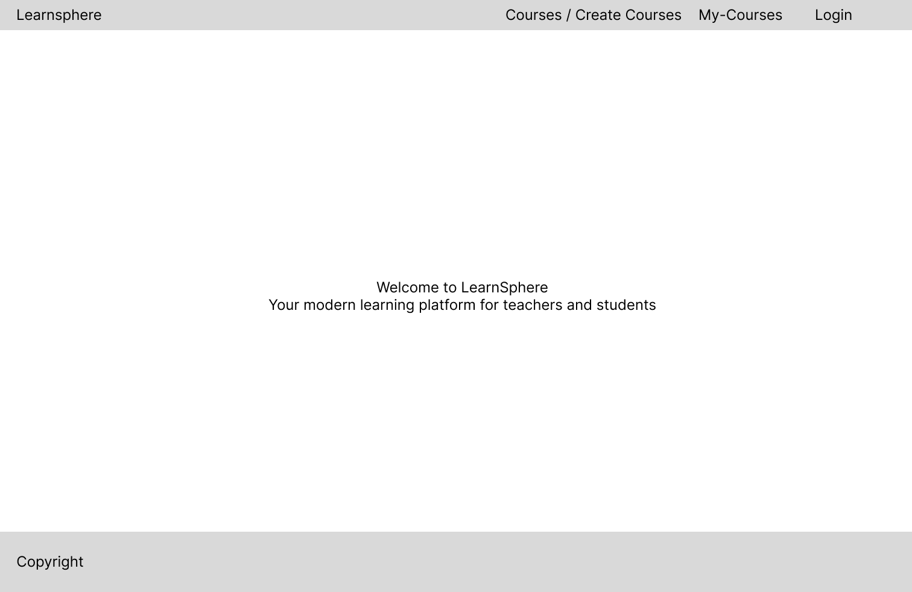

# Implementation

## Frontend
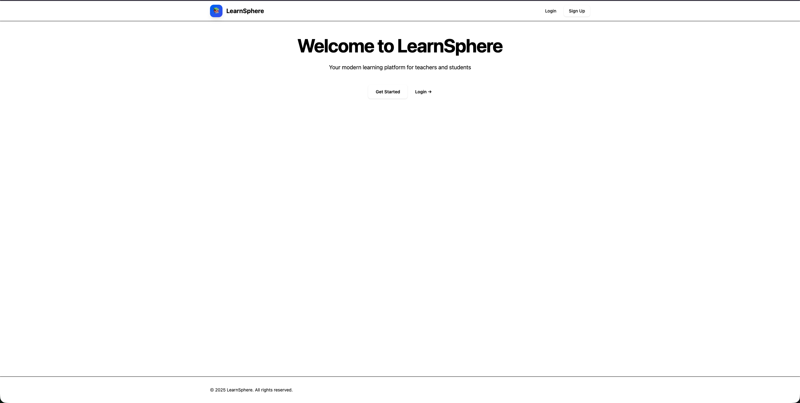

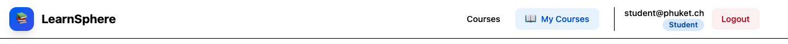

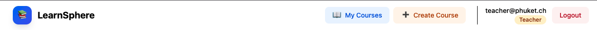

Die Homepage von LearnSphere ist die zentrale Einstiegsseite der Plattform und bietet eine übersichtliche, moderne Benutzeroberfläche. Abhängig vom Anmeldestatus und der Benutzerrolle passt sich die Navigation dynamisch an: Nicht angemeldete Nutzer sehen einen Willkommensbereich mit Einstiegsmöglichkeiten, während angemeldete Studierende und Lehrpersonen eine personalisierte Navigationsleiste mit kursbezogenen Funktionen, Rollenkennzeichnung und Logout-Option erhalten. Alle bewertungsrelevanten GUI-Elemente sind sichtbar und klar strukturiert dargestellt.

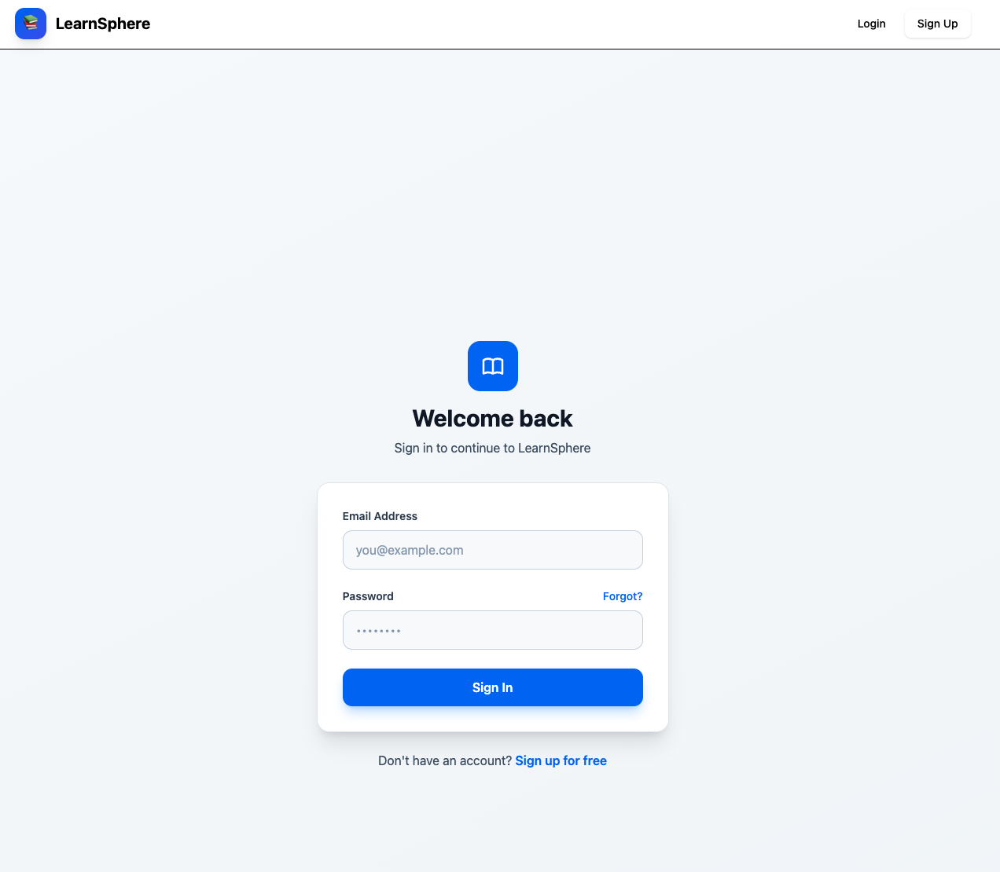

Die Login-Seite von LearnSphere ermöglicht registrierten Nutzern eine einfache und sichere Anmeldung. Sie besteht aus einem zentral platzierten Formular mit Eingabefeldern für E-Mail-Adresse und Passwort, sowie einem klar hervorgehobenen Login-Button. Zusätzlich wird ein direkter Link zur Registrierung für neue Nutzer angeboten.

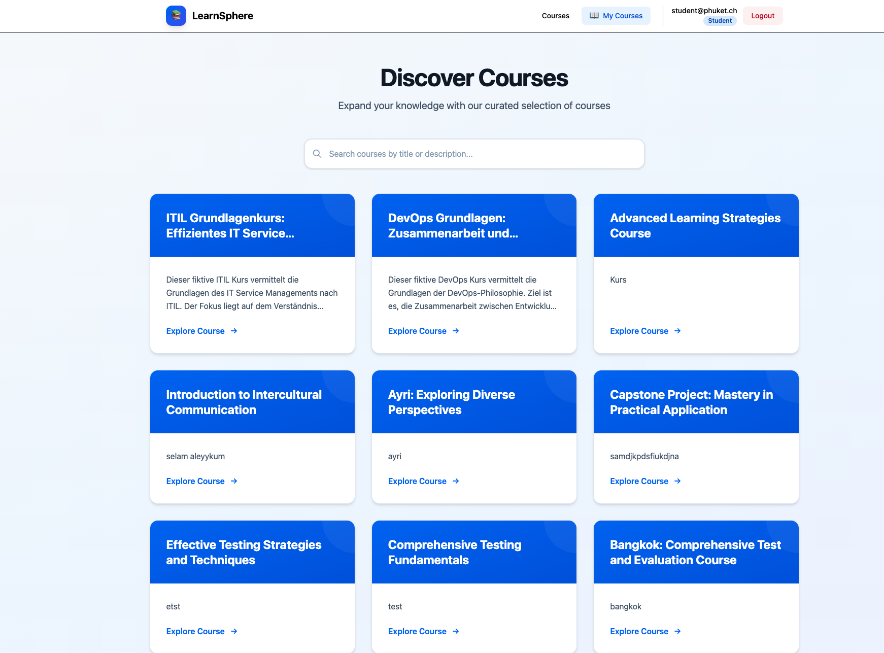
Die Courses-Seite für Studierende zeigt eine übersichtliche Kursübersicht in Kartenform. Über eine Suchleiste können Kurse nach Titel oder Beschreibung gefiltert werden. Jede Kurskarte enthält Titel, Kurzbeschreibung und einen „Explore Course“-Button, über den Studierende detaillierte Kursinformationen aufrufen und Kurse entdecken können.

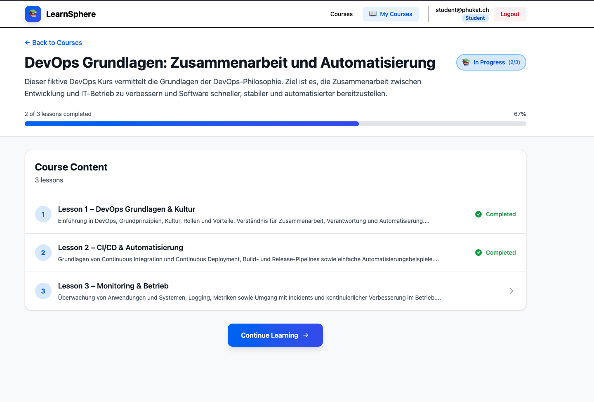
Die Kursdetailseite für Studierende zeigt den gewählten Kurs mit Titel, Beschreibung und aktuellem Lernfortschritt. Ein Fortschrittsbalken visualisiert den Abschluss der Lektionen, während die Kursinhalte übersichtlich in einzelne Lektionen gegliedert sind. Abgeschlossene Lektionen sind gekennzeichnet, und über den Button „Continue Learning“ können Studierende ihr Lernen fortsetzen.

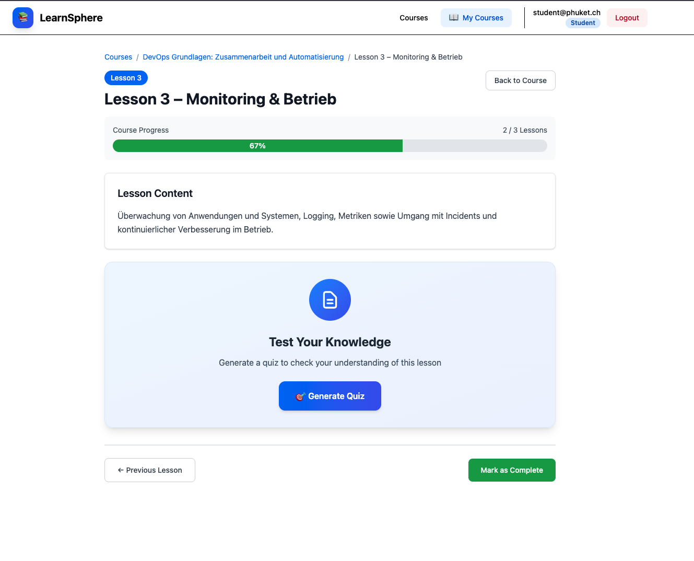
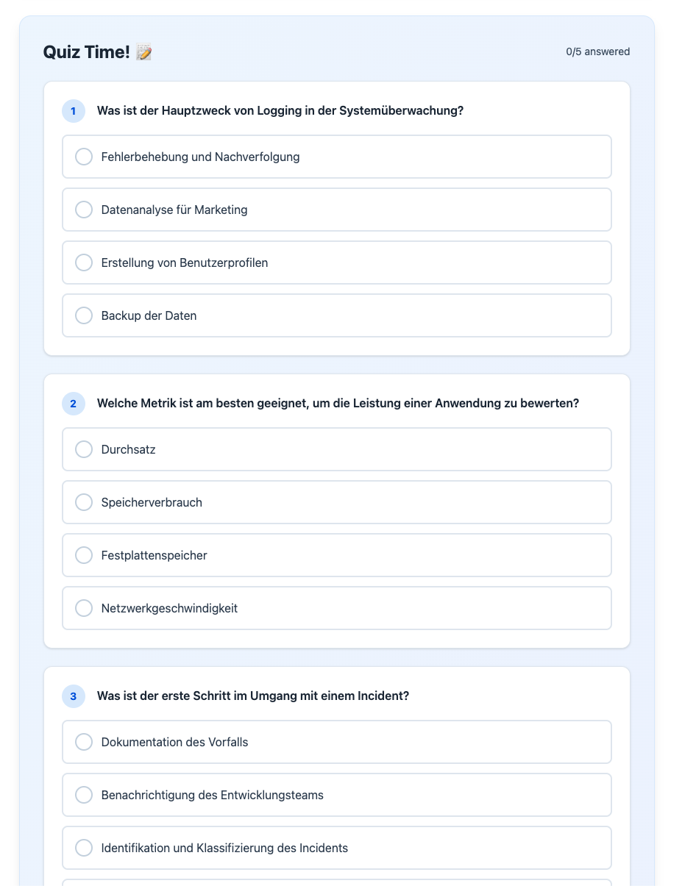
Die Lektionsseite für Studierende zeigt den Inhalt der ausgewählten Lektion sowie den aktuellen Kursfortschritt in Prozent. Zusätzlich steht eine Funktion zur Wissensüberprüfung zur Verfügung, mit der ein Quiz zur Lektion generiert werden kann. Navigationsbuttons ermöglichen den Wechsel zwischen Lektionen sowie das Abschließen der Lektion.

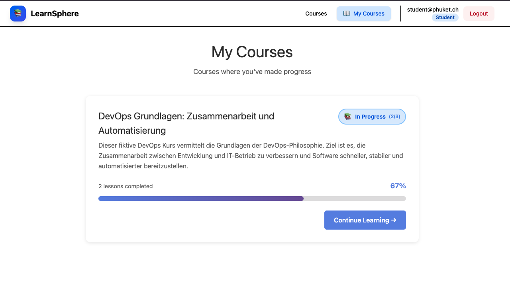
Die Seite „My Courses“ zeigt Studierenden alle Kurse, in denen bereits Lernfortschritte erzielt wurden. Für jeden Kurs werden Titel, Kurzbeschreibung, aktueller Fortschritt in Prozent sowie der Bearbeitungsstatus angezeigt. Über den Button „Continue Learning“ kann der Kurs direkt fortgesetzt werden.

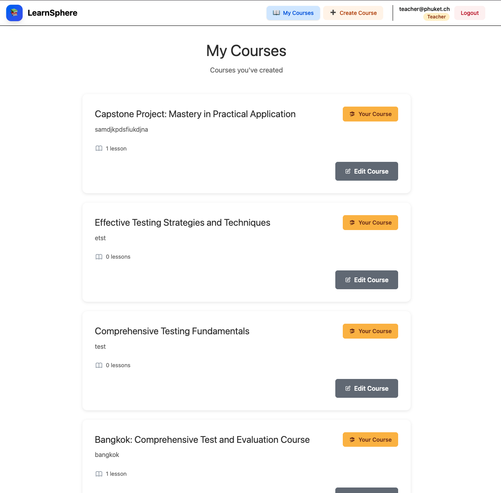
Die Seite „My Courses“ für Lehrpersonen zeigt alle selbst erstellten Kurse in einer übersichtlichen Listenansicht. Zu jedem Kurs werden Titel, Kurzbeschreibung sowie die Anzahl der enthaltenen Lektionen angezeigt. Lehrpersonen können ihre Kurse über den Button „Edit Course“ bearbeiten und haben über die Navigation zusätzlich Zugriff auf die Funktion „Create Course“.
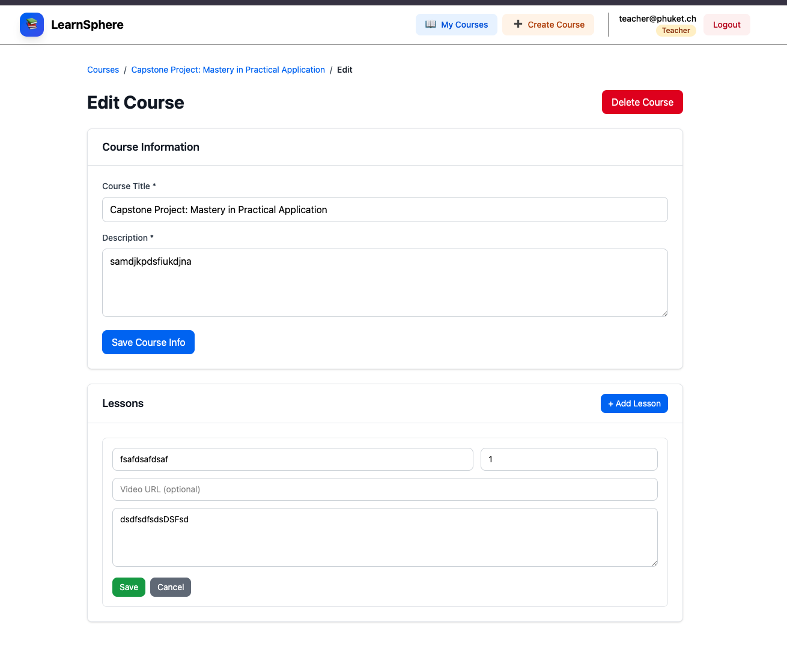
Die Kursbearbeitungsseite für Lehrpersonen ermöglicht das Verwalten von Kursinhalten. Lehrpersonen können Kurstitel und Beschreibung anpassen, Kurse löschen sowie Lektionen hinzufügen, bearbeiten oder speichern. Die Seite bietet dafür ein strukturiertes Formular mit klar getrennten Bereichen für Kursinformationen und Lektionen.

Die Seite „Create New Course“ ermöglicht Lehrpersonen das Erstellen neuer Kurse. Über ein Formular können Kurstitel und Beschreibung erfasst sowie optional Lektionen mit Inhalt und Video-URL hinzugefügt werden. Die Lektionen lassen sich dynamisch hinzufügen, anordnen oder entfernen, bevor der Kurs gespeichert wird.

## KI-Funktionen
Das eingebundene KI-Modell übernimmt zwei zentrale Aufgaben im System. Zum einen kann auf Basis der Lektionsbeschreibung automatisch ein Quiz generiert werden, mit dem Studierende ihr Verständnis der Inhalte überprüfen können. Zum anderen unterstützt die KI Lehrpersonen bei der Kurserstellung, indem aus der Kursbeschreibung automatisch ein passender Kurstitel vorgeschlagen bzw. generiert wird.
## Optionale Anforderungen
Tailwind CSS: Einsatz der Tailwind-CSS-Library zur Umsetzung eines konsistenten, responsiven und modernen Frontend-Designs.

# Fazit
## Stand der Implementation
Die LearnSphere-Applikation wurde erfolgreich umgesetzt und deckt alle geplanten Kernfunktionen ab. Sowohl Studierende als auch Lehrpersonen verfügen über klar getrennte und funktionsfähige Benutzeroberflächen. Studierende können Kurse entdecken, ihren Lernfortschritt verfolgen, Lektionen bearbeiten und ihr Wissen mithilfe KI-gestützter Quizfunktionen überprüfen. Lehrpersonen sind in der Lage, Kurse und Lektionen zu erstellen, zu bearbeiten und zu verwalten.

Die Integration der KI-Funktionen erweitert die Plattform sinnvoll, indem sie Lehrpersonen bei der Kurserstellung unterstützt und Studierenden eine automatisierte Lernkontrolle bietet. Das Frontend ist vollständig implementiert, übersichtlich strukturiert und mithilfe von Tailwind CSS modern und responsiv gestaltet. Insgesamt befindet sich die Applikation in einem stabilen und funktionsfähigen Zustand und erfüllt die definierten Anforderungen.

